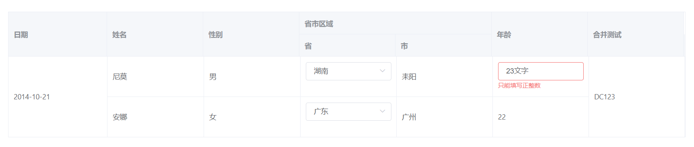

# el-validate-table

基于 element-ui 封装的可编辑，可校验，可合并的表格



```sh
yarn add el-validate-table or npm i el-validate-table
```

## 目录

* [介绍](#介绍)
* [特点](#特点)
* [示例](#示例)
* [参数说明](#参数说明)


## 介绍

**概要**

`el-validate-table` 是基于[element-ui](https://github.com/ElemeFE/element)封装的**表格组件**,采用 vue 中的 render 函数写法，支持高度的可扩展性，可复用性，通过 JSON 配置即可实现，表格中的单元格编辑校验，多级表头，单元格合并。

**背景**

基于 2019-4 月初某项目背景，项目中含有大量的多级表头，单元格编辑。项目初期，tempalte 中存在大量的结构代码，难以迭代，难以维护，基于此背景，为了节省时间，减少重复冗余的代码，让开发者专注业务逻辑。

<!-- **THANSK** -->

[⬆ Back to Top](#目录)

## 特点

* 只需进行简单的配置，即可实现单元格编辑（可校验）,多级表头，单元格合并等复杂功能
* 支持 _ElTable_, _ElTableColumn_ 的所有的API
* 支持单元格自定义校验
* 单元格支持自定义组件渲染
* 体验良好的校验交互

[⬆ Back to Top](#目录)

## 示例

1.基本用法

```vue
<template>
  <div class="validate-table-test">
    <el-validate-table :columns="columns" :data="data"></el-validate-table>
  </div>
</template>
<script>
export default {
  name: 'validate-table-test',
  data() {
    return {
      data: [
        {
          merge: 'DC123',
          date: '2014-10-21',
          name: '尼莫',
          sex: '男',
          old: 23,
          a: '1',
          b: '耒阳'
        },
        {
          merge: 'DC123',
          date: '2014-10-21',
          name: '安娜',
          sex: '女',
          old: 22,
          a: '2',
          b: '广州'
        }
      ],
      columns: [
        {
          prop: 'merge',
          label: '合并测试',
          isMerge: true
        },
        {
          prop: 'date',
          label: '日期',
          isMerge: true
        },
        {
          prop: 'name',
          label: '姓名'
        },
        {
          prop: 'sex',
          label: '性别'
        },
        {
          prop: 'test',
          label: '省市区域',
          children: [
            {
              prop: 'a',
              label: '省',
              config: params => ({
                  type: 'el-select',
                  rules: [
                    {
                      required: true,
                      message: '不能为空',
                      trigger: 'change'
                    }
                  ],
                  options: [
                    {
                      value: '',
                      label: '全部'
                    },
                    {
                      value: '1',
                      label: '湖南'
                    },
                    {
                      value: '2',
                      label: '广东'
                    }
                  ]
                })
            },
            {
              prop: 'b',
              label: '市'
            }
          ]
        },
        {
          prop: 'old',
          label: '年龄',
          config: params => {
            const {rowIndex} = params
            if (rowIndex == 0) {
              return {
                type: 'el-input',
                rules: [
                  {
                    required: true,
                    message: '年龄不能为空',
                    trigger: 'blur'
                  },
                  {
                    pattern: /^[1-9]\d*$/,
                    message: '只能填写正整数',
                    trigger: 'blur'
                  }
                ]
              }
            }
          }
        }
      ]
    }
  }
}
</script>
```

[⬆ Back to Top](#目录)

<!-- * [doc and online demo](https://nemoisme.github.io/el-validate-table/) -->


## 参数说明

- 外部参数说明

| 参数    | 说明                                                       | 类型    |
|---------|------------------------------------------------------------|---------|
| data    | 匹配的数据，与 element-ui,el-table 用法相同                | Array   |
| columns | 列配置，支持 el-table-column 所有的配置项，格外扩展 config | Array   |


- columns 参数说明 

| 参数             | 说明           | 类型     |
|--------------------------|------------------------------------|----------|
| prop             | 绑定的列字段   | string   |
| label            | 列标题显示     | string   |
| children         | 子级表头配置   | array    |
| render(h,params) | 自定义渲染元素 | function |
| component        | 自定义组件     | vnode    |
| formatter        | 格式化列单元格数据 | function |

- config(rowIndex,row,columnIndex,prop,column) 配置说明

| 参数  | 说明                        | 类型   |
|----------------------|--------------------------------------|-----------|
| type  | 渲染的元素tag or 组件的name | stirng |
| rules | 对表单元素的校验            | array  |
| event | 事件                        | object |
| style | 样式                        | object |
| attrs | 外部参数                    | object |
| ...other | Form-Item Attributes     | any |

[⬆ Back to Top](#目录)
